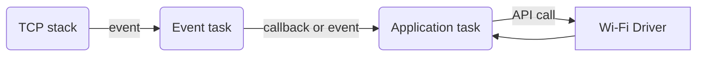
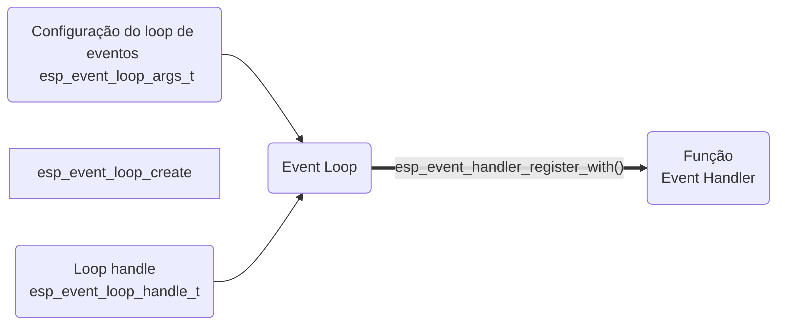

# Wifi 

### Modelo de conexão

### Etapas de coneção do Wifi

1. Wifi/LwIP Init Phase 

    - Fase de inicialização da stack LwIP e tarefas de gerência dos drivers associados.

2. Wifi Configuration Phase

    - Fase de configuração do driver de wifi

3. Wifi Start Phase

    - Inicializa o driver do wifi

4. Wifi connect phase
    
    - Conecta a um Access Point

5. Wifi 'Got IP' Phase
    
    - Recebe um IP válido do AP

6. Wifi Disconect Phase

    - Desconecta do ap (por motivos diversos)

7. Wifi IP Change Phase

    - Evento que o ocorre caso o IP seja alterado

8. Wifi Deinit Phase

    - Desconecta do wifi, para e descarrega o driver

### Loop de controle de Eventos (Event Loop)

- A biblioteca permite que componentes do sistema registrem seus eventos para que funções de tratamento possam capturar e tratar.

- Essa funcionalidade permite a criação de compomentes desacoplados e simplifica o processamento de eventos através da serialização dos eventos e de sua delegação para que sejam tratados em outros contextos.

